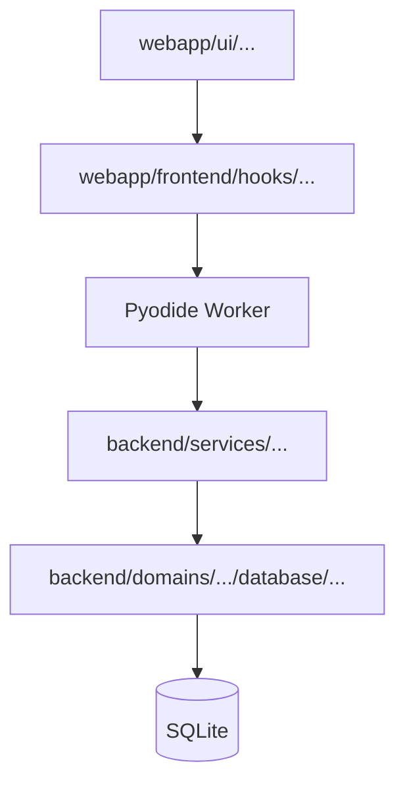

# AGENTS.md — Guide pour Agents IA

> Contexte : **Gestio V4 Mobile** (React + Pyodide + Capacitor). Pas de Streamlit.
> Ce fichier remplace tous les fichiers `.agent/workflows/*.md` et `.github/copilot-instructions.md`.

---

## 1. Commandes de Build, Lint et Test

> 💡 **Astuce** : Lancer l'agent via **Git Bash** (terminal Linux) pour de meilleures performances et commandes Unix fonctionnelles.

### Dépendances
```bash
uv sync                    # Installer les dépendances Python
cd webapp && npm install   # Dépendances React/TypeScript
```

### Lancement
```bash
# Backend Python (via Pyodide dans le browser)
# → Lancer le serveur de dev React :
cd webapp && npm run dev

# Tests Python
pytest

# Exécuter un seul fichier de test
pytest tests/test_transactions/test_repository.py

# Exécuter un seul test
pytest tests/test_transactions/test_repository.py::test_add_retourne_un_id

# Tests par motif
pytest -k "test_add"

# Tests unitaires uniquement (sans DB)
pytest -m unit

# Tests d'intégration (avec DB)
pytest -m integration

# Tests OCR (nécessite GROQ_API_KEY)
pytest -m ocr
```

### Build Mobile
```bash
# Build iOS
cd webapp && npx cap sync ios && npx cap open ios

# Build Android
cd webapp && npx cap sync android && npx cap open android
```

---

## 2. Style de Code

### Général
- **Python 3.12+** exclusivement
- **Type hints** obligatoires sur toutes les fonctions publiques
- **Pydantic** pour la validation des modèles de données
- **200 lignes max** (alerte), **300 lignes absolu** — au-delà, subdiviser (SRP)
- **Pas de code mort commenté** — supprimer (YAGNI)
- **Pas de `print()`** — utiliser `logging.getLogger(__name__)`

### Imports
- **Imports absolus uniquement** — jamais de `.` relatifs
  ```python
  # ✓ Bon
  from domains.transactions.database.model import Transaction
  from shared.ui.helpers import render_card

  # ✗ Mauvais
  from .model import Transaction
  ```

- **Utiliser `pathlib.Path`** au lieu de `os.path`

### Nommage
| Élément | Convention | Exemple |
|---------|------------|---------|
| Fichiers Python | snake_case | `transaction_service.py` |
| Classes | PascalCase | `TransactionRepository` |
| Fonctions/méthodes | snake_case | `get_all()` |
| Constants | UPPER_SNAKE | `MAX_FILE_SIZE` |
| Fichiers TypeScript | kebab-case | `transaction-list.tsx` |
| Composants React | PascalCase | `TransactionList.tsx` |
| Hooks React | camelCase | `useTransactions.ts` |

### Données
- **Tous les champs DB, modèles** : en français
- **Catégories** : Title Case normalisé
- **Montants** : toujours positifs — le type (Dépense/Revenu) détermine le sens

### Base de Données
- **Toujours passer par un Repository** — jamais de SQL direct dans les pages/views
- **SQLite** via `shared/database/connection.py`

### Pandas / DataFrames
- **INTERDIT dans Pyodide** — utiliser des listes de dictionnaires ou `cursor.fetchall()`
- **Pas de `iterrows()`** — vectorisation pandas (uniquement côté desktop si besoin)

### UI Streamlit (legacy)
- **SUPPRIMÉ** — l'app mobile utilise React uniquement

### Tests
- **Fichier de test obligatoire** pour toute logique métier :
  - `services/mon_service.py` → `tests/test_services/test_mon_service.py`
- **DB isolée** : chaque test utilise une DB SQLite `:memory:` via fixture `repo` de `conftest.py`
- **Mock obligatoire** pour les API LLM/OCR (pas de consommation crédits)
- **Marqueurs pytest** :
  - `@pytest.mark.unit` — test unitaire pur (sans DB ni fichiers)
  - `@pytest.mark.integration` — test avec base de données

---

## 3. Architecture DDD — 3 Zones

```
vmobile/
├── backend/              # Python pur (Pyodide/WebWorker)
│   ├── domains/          # Logique métier cloisonnée
│   │   └── transactions/
│   │       ├── database/    # Modèles, repositories, schéma
│   │       ├── services/    # Logique métier
│   │       └── ocr/         # Extraction OCR/LLM
│   └── shared/           # Composants Python réutilisables
├── webapp/               # React/TypeScript pur
│   ├── ui/              # Composants visuels (dumb/presentational)
│   │   └── components/  # Button, Card, Toast, etc.
│   └── frontend/        # Logique client (hooks, state)
│       └── domains/      # Par domaine
└── .agent/              # Règles pour agents (ce fichier)
```

### Règles DDD
- **Zone backend** : uniquement `.py` — aucun `.ts`/`.tsx`
- **Zone webapp** : uniquement `.ts`/`.tsx` — aucun `.py`
- **Pas de dépendance circulaire** : un domaine n'en importe pas un autre
- **Repository pattern** : tout accès DB via `backend/domains/<domaine>/database/repository_*.py`

---

## 4. Mobile / Pyodide — Règles Critiques

> **vmobile** = Version mobile uniquement. Pas de double abstraction Desktop/Mobile.

### Dépendances INTERDITES dans Pyodide
Ces librairies sont **trop lourdes** pour le navigateur mobile :
- ❌ `pandas`
- ❌ `opencv-python`
- ❌ `rapidocr_onnxruntime`
- ❌ `streamlit`
- ❌ `plotly`

**Alternative** : utiliser `cursor.fetchall()` ou listes de dictionnaires

### SQLite — CapacitorConnection (SEULEMENT)
```python
# shared/database/connection.py
# Une SEULE implémentation : CapacitorConnection

from capacitor_sqlite import CapacitorConnection

conn = CapacitorConnection()
result = conn.execute("SELECT * FROM transactions", ())
```

- **Mobile** : `@capacitor-community/sqlite` (pas de WAL → DELETE ou MEMORY)
- Pas de `DesktopConnection` → vmobile = mobile only

### Fichiers — CapacitorStorage (SEULEMENT)
```python
# shared/storage/capacitor_storage.py
from capacitor_filesystem import CapacitorStorage

storage = CapacitorStorage()
storage.save(data, "tickets/ticket1.pdf")
```

### PWA — Cold Start ~5s
| Étape | Avant PWA | Après PWA |
|-------|-----------|-----------|
| Download WASM | 5-10s (réseau) | 0s (cache) |
| Parse WASM + Init Python | ~5s | ~5s |
| Import modules | 5-10s | ~0s |
| **TOTAL** | **15-30s** | **~5s** |

**Implémentation** :
- Vite PWA plugin avec cache-first pour Pyodide
- Preload en background après premier lancement
- Skeleton UI pendant chargement

### OCR
- **Online** : Azure Vision API (OpenAI)
- **Offline** : ML Kit via plugin Capacitor
- **Parser LLM** : `groq_parser.py` fonctionne dans Pyodide

### Pyodide
- **Toujours dans un Web Worker** — jamais sur le main thread
- **Appels async** : `await pyodide.runPythonAsync()`

---

## 5. Webapp React — Flux de Données

```
webapp/ui/components/  (React dumb)
        ↓
webapp/frontend/hooks/  (logique JS)
        ↓
Pyodide Web Worker  (Python)
        ↓
backend/domains/*/services/  (logique métier)
        ↓
backend/domains/*/database/repository  (SQL)
        ↓
SQLite
```

### Règles
- **Pas de SQL dans webapp/** — tout passe par le Repository Python
- **State** : React (Zustand, Context, Hooks)
- **Composants UI** : dumb/presentational — pas de logique métier
- **Helpers globaux** : `webapp/ui/components/` (Button, Card, Toast)

---

## 6. Sécurité

- **NE JAMAIS** commiter : `.db`, `.sqlite`, `.env`, `.key`, `.pem`
- **Secrets** : variables d'environnement uniquement
- **API keys** : jamais en clair dans le code

---

## 7. Début de Session

**Vérifier que les commandes Linux fonctionnent** :
```bash
ls -la
```
Si erreur, **demander à l'utilisateur de relancer la session dans Git Bash**.

Avant toute modification :

1. **Demander à l'utilisateur** :
   - Sur quelle **branche** ?
   - Sur quelle **Issue** (`#numéro`) ?

2. **Lire les fichiers de contexte** :
   - `.agent/terms.md` pour le vocabulaire métier
   - **README du dossier** concerné avant de modifier

3. **Vérifier** `.env` si OCR activé (`GROQ_API_KEY`)

---

## 8. ⚡ Comprendre avant de Modifier

**RÈGLE OBLIGATOIRE : AVANT de modifier un domaine, lire en premier `LOGIC_FLOW.md` du domaine.**

**Avant toute modification de code, l'agent DOIT :**

1. **Lire `LOGIC_FLOW.md`** du domaine concerné (ex: `backend/domains/transactions/LOGIC_FLOW.md`)
2. **Lire le README du dossier** pour comprendre la structure locale
3. **Comprendre le flux de données complet** : UI → Hook → Pyodide → Service → Repo → DB

### Quand créer un LOGIC_FLOW.md ?

| Déclencheur | Exemple |
|-------------|---------|
| Nouvelle vue UI | `scan_view.tsx` |
| Nouveau hook frontend | `useScan.ts` |
| Nouveau service backend | `transaction_service.py` |
| Nouvelle pipeline | OCR, Import CSV |

### Format LOGIC_FLOW.md

```markdown
# LOGIC_FLOW - [Nom du Domaine]

## Vue d'ensemble (TOUTE la pipeline)



## Pipelines détaillées

### Pipeline: [Nom]
1. Étape 1
2. Étape 2
3. ...
```

### Où placer LOGIC_FLOW.md ?

```
backend/domains/transactions/
├── LOGIC_FLOW.md      ← 1er fichier à lire pour ce domaine
├── database/
├── services/
├── ocr/
└── recurrence/
```

> ❌ **Ne jamais modifier un fichier sans avoir lu LOGIC_FLOW.md au préalable.**
> ❌ **Ne jamais supposer qu'un dossier est vide ou identique à ce qu'on imagine**

---

## 9. Commit

### Format obligatoire
```
git commit -m "<type>: <description> #<numero_issue>"
```

### Types autorisés
| Type | Description |
|------|-------------|
| `feat:` | Nouvelle fonctionnalité |
| `fix:` | Correction de bug |
| `refactor:` | Nettoyage/optimisation (ex: découpage sous 300 lignes) |
| `chore:` | Mise à jour de configuration, dépendances |

### Contenu du commit
- **Titre** : type + description courte
- **Corps** : lister chaque fichier modifié avec courte explication
  - `backend/domains/transactions/services/transaction_service.py` — ajout méthode get_filtered
  - `tests/test_transactions/test_repository.py` — ajout tests CRUD
  - `AGENTS.md` — mise à jour conventions

### Exemple
```
feat: ajout filtre par catégorie dans le repository #12

- backend/domains/transactions/database/repository_transaction.py — ajout paramètre category
- backend/domains/transactions/services/transaction_service.py — déléguage au repository
- tests/test_transactions/test_repository.py — tests filtration par catégorie
```
