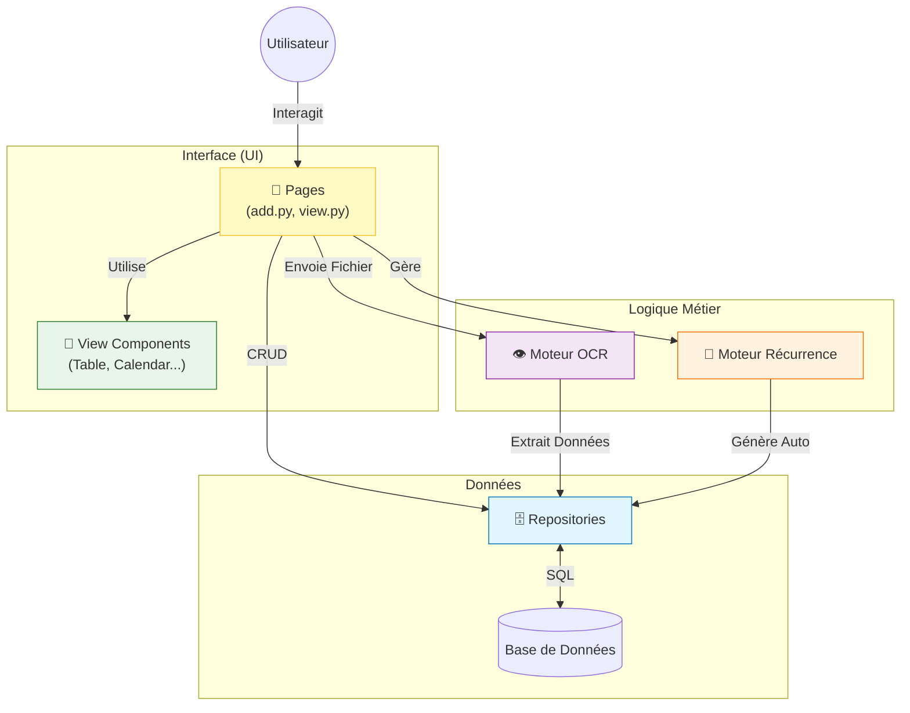

# 💰 Domaine Transactions

Bienvenue dans le centre nerveux de l'application. Ce module gère **toutes** les opérations financières (dépenses,
revenus, virements).

## 🗺️ Carte du Module

Ce dossier est divisé en sous-modules spécialisés. Cliquez sur les liens pour accéder à la documentation détaillée de
chaque partie :

| Dossier           | Rôle                                                     | Documentation                             |
|:------------------|:---------------------------------------------------------|:------------------------------------------|
| **`pages/`**      | **Contrôleurs** (Points d'entrée de l'UI)                | [📄 Lire la doc](pages/README.md)         |
| **`view/`**       | **Interface** (Composants visuels, Tableaux, Graphiques) | [🎨 Lire la doc](view/README.md)          |
| **`database/`**   | **Données** (Schéma SQL, Repositories)                   | [🗄️ Lire la doc](database/README.md)     |
| **`recurrence/`** | **Moteur Temporel** (Abonnements, Échéances)             | [🔄 Lire la doc](recurrence/README.md)    |
| **`ocr/`**        | **Intelligence Artificielle** (Scan de tickets/PDF)      | [👁️ Lire la doc](ocr/services/README.md) |

---

## 🏗️ Architecture Globale

Comment tout cela fonctionne ensemble ? Voici le flux de données principal :

## 🚀 Guide Rapide

### Je veux modifier...

- **L'apparence du tableau des transactions ?**
  👉 [`view/components/transaction_table.py`](view/components/transaction_table.py) (Doc: [
  `view/README.md`](view/README.md))

- **La façon dont on ajoute une transaction ?**
  👉 [`pages/add.py`](pages/add.py) (Doc: [`pages/README.md`](pages/README.md))

- **La détection des prix sur les tickets ?**
  👉 [`ocr/services/pattern_manager.py`](ocr/services/pattern_manager.py) (Doc: [
  `ocr/services/README.md`](ocr/services/README.md))

- **Le calcul des mensualités d'abonnement ?**
  👉 [`recurrence/recurrence_service.py`](recurrence/recurrence_service.py) (Doc: [
  `recurrence/README.md`](recurrence/README.md))
