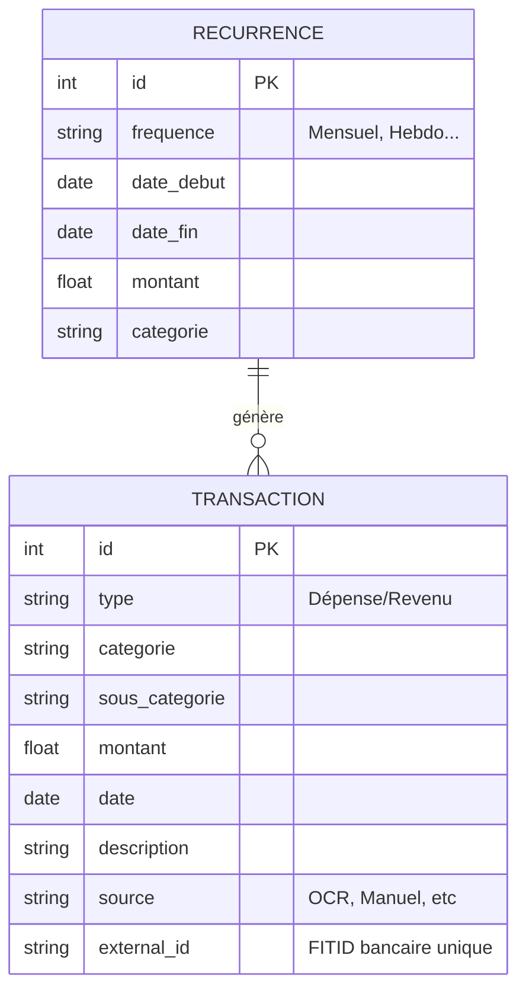

# Architecture Données (Database)

Cette couche gère la persistance des données. Elle utilise le pattern **Repository** pour découpler la logique métier du
moteur stockage (SQLite).

## 🗄️ Schéma de Données (ER Diagram)

Les deux entités principales sont les `Transactions` (historique) et les `Récurrences` (règles futures).

## 🛠️ Pattern Repository

L'accès direct SQL est interdit dans les couches supérieures (Pages/Services). On passe obligatoirement par les
repositories.

### `TransactionRepository`

- **Mapping** : Convertit les lignes SQL (`row`) en objets Python (`Transaction`).
- **Validation** : Vérifie l'intégrité des données (Types, Montants > 0) avant insertion.
- **Optimisation** : Utilise `Pandas` pour charger rapidement de gros volumes de données en lecture seule (Dashboard).

### `RecurrenceRepository`

- Gère le cycle de vie des abonnements.
- Inclut la logique pour **projeter** les futures occurrences (génération virtuelle des transactions à venir).

## 🛡️ Sécurité & Intégrité

- **Unicité** : Le champ `external_id` (indexé UNIQUE) empêche les doublons lors des imports bancaires.
- **Types** : Les montants sont toujours stockés en `REAL`, les dates en `TEXT` (ISO 8601).
