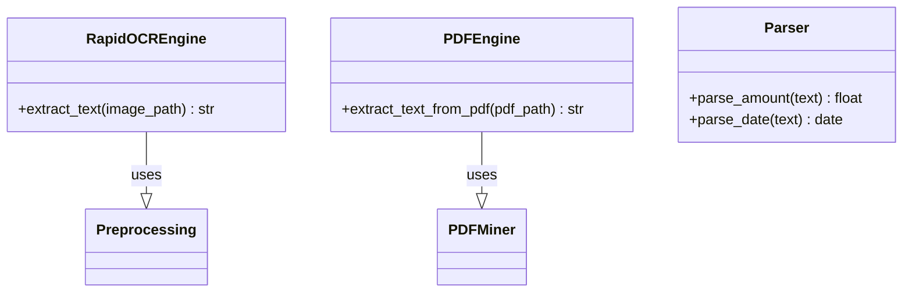

# Architecture OCR Core

Ce module constitue la couche **bas niveau** du moteur de reconnaissance. Il encapsule les bibliothèques tierces pour
fournir une abstraction propre au reste de l'application.

## 🛠️ Stack Technique

### 1. RapidOCR (`rapidocr_onnxruntime`)

- **Rôle** : Moteur OCR principal pour les images.
- **Pourquoi ?** :
    - Plus léger et rapide que Tesseract.
    - Utilise `ONNX Runtime` pour une inférence CPU optimisée.
    - Supporte nativement la détection de texte orienté (pas seulement horizontal).
- **Fichier** : `rapidocr_engine.py`

### 2. PDFMiner (`pdfminer.six`)

- **Rôle** : Extraction de texte depuis les PDF natifs (relevés bancaires).
- **Pourquoi ?** :
    - Extraction précise de la structure (positions).
    - Pas de conversion image nécessaire (plus rapide et précis que l'OCR sur PDF).
- **Fichier** : `pdf_engine.py`

### 3. OpenCV (`opencv-python-headless`)

- **Rôle** : Prétraitement d'image.
- **Opérations** :
    - Redimensionnement (pour améliorer la détection des petits textes).
    - Binarisation / Seuillage (pour nettoyer le bruit de fond).
    - Désinclinaison (Deskewing).

### 4. Regex & Parsing

- **Rôle** : Extraction structurée depuis le texte brut.
- **Fichiers** : `parser.py`, `llm_parser.py` (expérimental).

## 🧩 Diagramme de Classe Simplifié

