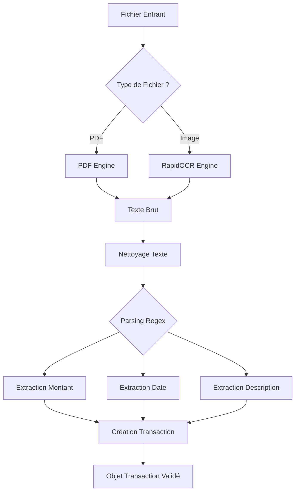

# Service d'Orchestration OCR

Ce module orchestre le flux complet de transformation : **Fichier Brut** $\to$ **Donnée Structurée (Transaction)**.

## 🔄 Flux de Traitement (Pipeline)

Le `OCRService` agit comme un chef d'orchestre. Voici les étapes détaillées :

## 🧠 Composants Clés

### `OCRService` (`ocr_service.py`)

Point d'entrée unique. Il décide quel moteur utiliser et comment assembler les résultats.

### `PatternManager` (`pattern_manager.py`)

Gère les expressions régulières (Regex) pour identifier :

- **Montants** : `12,50 €`, `12.50`, etc.
- **Dates** : `12/12/2023`, `12-DEC-23`, etc.

## ⚠️ Gestion des Erreurs

- **Fichier Illisible** : Exception levée si le moteur ne retourne aucun texte.
- **Parsing Échoué** : Si aucun montant n'est trouvé, une erreur explicite est remontée à l'UI pour demander une saisie
  manuelle.
- **Fallback** : Si la date n'est pas trouvée, la date du jour est proposée par défaut.
