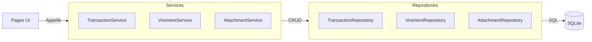

# Services (Logique Métier)

Ce dossier contient la **couche service** qui fait le lien entre les Pages (UI) et les Repositories (Données).

## 🎯 Rôle

Les Services encapsulent la **logique métier** :

- Transformation de données (mapping, conversion)
- Appels aux Repositories
- Logique complexe (calculs, aggregations)
- Orchestration de plusieurs opérations

## 📂 Contenu

| Fichier                      | Responsabilité                                      |
|------------------------------|-----------------------------------------------------|
| **`transaction_service.py`** | Lecture/filtrage des transactions, mapping DB↔Model |
| **`virement_service.py`**    | Gestion des virements (transferts entre comptes)    |
| **`attachment_service.py`**  | Gestion des fichiers joints (tickets, PDF)          |

## 🔄 Flux de données

## 📋 Méthodes par Service

### TransactionService

- `get_transaction_by_id(tx_id)` → Transaction
- `get_filtered_transactions_df(start, end, category)` → pd.DataFrame

### VirementService

- `get_all_virements_df()` → pd.DataFrame
- `get_virement_by_id(v_id)` → Virement

### AttachmentService

- `add_attachment(...)` → bool
- `get_attachments(transaction_id)` → List[TransactionAttachment]
- `delete_attachment(attachment_id)` → bool

## ⚡ Point important

Les Services **ne font pas de SQL direct** (sauf pour la récurrence qui est un cas spécial). Ils délèguent tout au
Repository.

Voir aussi :

- [README principal du domaine](../README.md)
- [Database README](../database/README.md)
- [Pages README](../pages/README.md)
