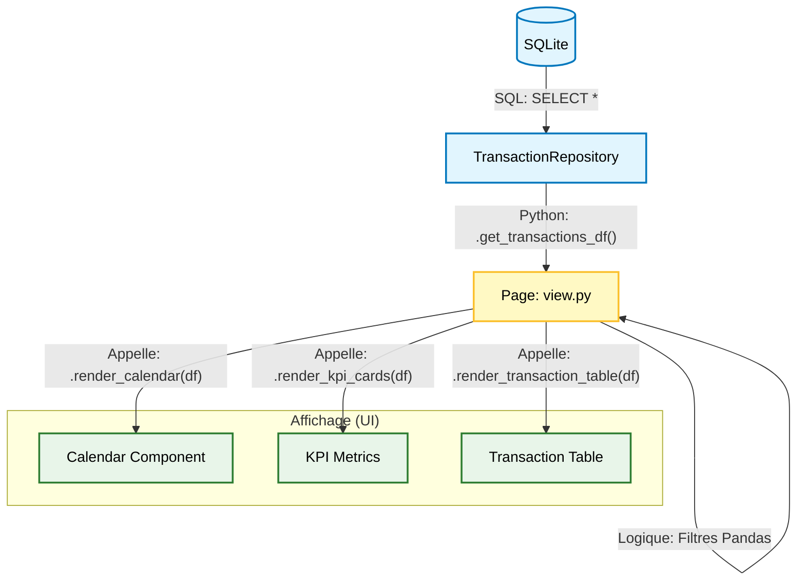

# 🎨 Architecture Interface (View)

Bienvenue dans la documentation de l'interface utilisateur des Transactions.
Ce document est conçu pour être **simple à comprendre** tout en allant **au fond des choses**.

---

## 🧐 Qu'est-ce que c'est ?

Le dossier `view/` contient tout ce qui est visible à l'écran. Il ne contient **aucune logique métier complexe** (pas de
calculs de taxes, pas d'accès base de données direct).
Son rôle est simple : **Prendre des données ➡️ Les afficher joliment.**

---

## 🧩 Les Composants Clés

Nous utilisons une approche par "composants" (comme des briques Lego). Chaque fichier dans `components/` est une brique
réutilisable.

### 1. Le "Sunburst" (`sunburst_navigation`)

C'est le camembert interactif à plusieurs niveaux.

- **Pourquoi ?** Pour permettre à l'utilisateur de "plonger" dans ses dépenses : *Dépenses -> Alimentation ->
  Supermarché*.
- **Comment ça marche ?**
    1. **Python** : Prépare une hiérarchie de données (JSON).
    2. **JavaScript (React/D3)** : Affiche le graphique (c'est un composant personnalisé Streamlit).
    3. **Retour** : Quand on clique, le JS renvoie le code de la catégorie à Python via `st.session_state`.

### 2. Le Calendrier (`calendar_component.py`)

Ce n'est pas un simple sélecteur de date, c'est une *carte thermique* de vos finances.

- **Visuel** : Affiche des points (🔴 Dépense, 🟢 Revenu) sur les jours du mois.
- **Technique** :
    - Utilise `st.columns` pour dessiner une grille 7x5.
    - Injecte du HTML/CSS custom pour les petites "bulles" colorées.
    - Ne recharge pas toute la page à chaque clic grâce aux `fragments` (optimisation).

### 3. Le Tableau (`transaction_table.py`)

La liste principale des transactions.

- **Technologie** : `AgGrid` (le standard industriel pour les tableaux de données).
- **Super-pouvoirs** :
    - **Édition en ligne** : Double-cliquez pour modifier le montant ou la description.
    - **Tri/Filtre** : Comme Excel, directement dans le navigateur.
    - **Pagination** : Pour ne pas faire ramer le navigateur si vous avez 10 000 transactions.

---

## 🔄 Le Cycle de Vie d'un Affichage

Voici ce qui se passe quand vous ouvrez la page "Voir Transactions" :

1. **Chargement** : `view.py` appelle le **Repository** pour récupérer les données brutes.
2. **Filtrage** : La page applique les filtres en mémoire (Pandas) selon la sélection utilisateur.
3. **Rendu** : La page appelle chaque **Composant** spécifique avec le jeu de données filtré.

## 🧠 Gestion de l'État (`session_state`)

L'application a une "mémoire court-terme". Si vous filtrez sur "Janvier" et cliquez sur une transaction, la page se
recharge mais **se souvient** que vous étiez sur "Janvier".

- `date_range` : La période sélectionnée dans le calendrier.
- `selected_categories` : Les catégories cliquées dans le Sunburst.

---

## 💡 Note pour les Développeurs

- **Si vous voulez modifier une couleur** : Allez dans `charts.py` (pour les graphiques) ou `calendar_component.py` (
  pour les bulles).
- **Si vous voulez ajouter une colonne au tableau** : Allez dans `transaction_table.py`, configuration `column_defs`.
