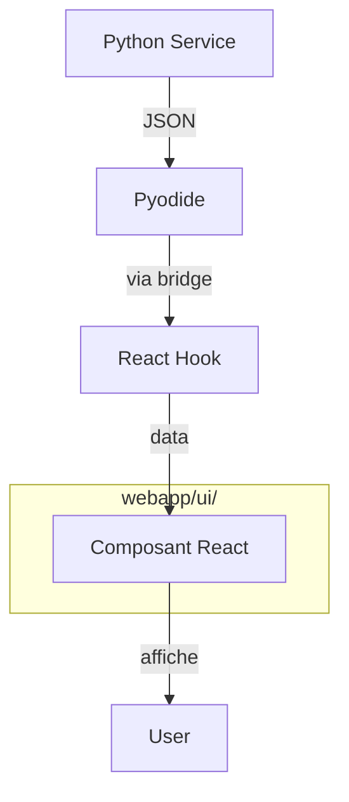

# 🎨 Architecture Interface (View)

> **Composants visuels** pour les Transactions — version React mobile.

## 🧐 Qu'est-ce que c'est ?

Le dossier `view/` contient les composants React (dumb/presentational) pour afficher les transactions.
**Aucune logique métier** ici — juste de l'affichage.

> 💡 Ce dossier est dans **webapp/ui/domains/transactions/** (React), pas dans backend/

---

## 🧩 Composants Clés

### TransactionList

Tableau des transactions.

- **Technologie** : Composant React
- **Props** : liste de transactions (via hooks)

### CalendarView

Calendrier avec heatmap des finances.

### TransactionForm

Formulaire d'ajout/modification.

---

## 🔄 Flux de données

```mermaid
graph TD
    Python[Python Service] -->|JSON| Pyodide
    Pyodide -->|via bridge| Hook[React Hook]
    Hook -->|data| View[Composant React]
    View -->|affiche| User
    
    subgraph "webapp/ui/"
        View
    end
```

---

## 💡 Note pour les Développeurs

- **Composants dumb** : pas de logique métier, seulement des props
- **Données via hooks** : `useTransactions()`, `useScan()`, etc.
- **Pas de SQL dans webapp/** — tout passe par Pyodide
