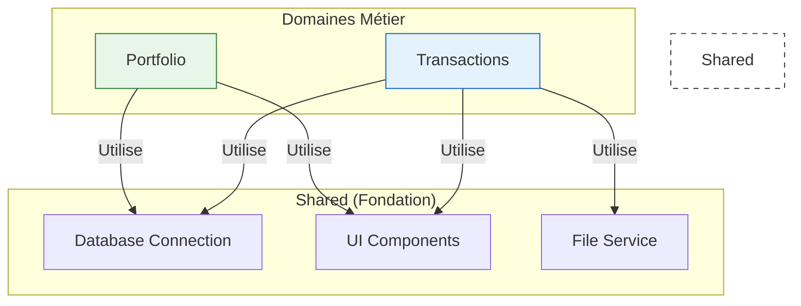

# 🧱 Shared (Bibliothèque Partagée)

Bienvenue dans la **boîte à outils** de FinBoard.
Ce dossier contient tout le code qui est utilisé par **plusieurs domaines** (Transactions & Portfolio).

> **Règle d'Or** : Si une fonction est utilisée dans `domains/transactions` ET `domains/portfolio`, elle doit venir ici.
> Si elle n'est utilisée que dans un seul domaine, elle doit rester dans ce domaine.

## 🗺️ Carte du Module

| Dossier         | Rôle                                                 | Documentation                         |
|:----------------|:-----------------------------------------------------|:--------------------------------------|
| **`database/`** | **Connexion SQL** (Gestionnaire de connexion unique) | [🗄️ Lire la doc](database/README.md) |
| **`services/`** | **Services Transverses** (Fichiers, Sécurité)        | [⚙️ Lire la doc](services/README.md)  |
| **`ui/`**       | **Composants UI** (Toasts, Badges, Styles)           | [🎨 Lire la doc](ui/README.md)        |

---

## 🏗️ Architecture Transverse

`Shared` est la fondation sur laquelle reposent les domaines.

## 🚀 Guide Rapide

### Je cherche...

- **Où est configurée la connexion SQLite (WAL, Timeout) ?**
  👉 [`database/connection.py`](database/connection.py)

- **Comment afficher une notification "Succès" ?**
  👉 [`ui/toast_components.py`](ui/toast_components.py)

- **La logique qui déplace les fichiers quand on change une catégorie ?**
  👉 [`services/file_service.py`](services/file_service.py)
