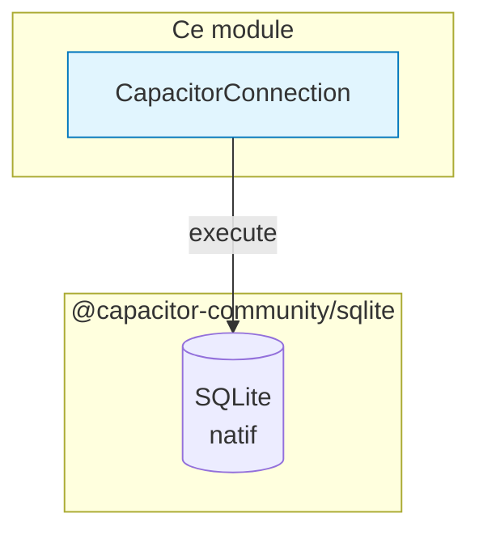

# 🗄️ Shared Database

> **Point d'entrée SQLite** pour Mobile (Pyodide + Capacitor)

> 📍 Position dans le flux : voir [LOGIC_FLOW.md](../../domains/transactions/LOGIC_FLOW.md)



## 🔌 CapacitorConnection (SEULEMENT)

> ⚠️ **vmobile** = Mobile uniquement. Pas de double abstraction.

```python
from shared.database import get_connection

conn = get_connection()
results = conn.execute("SELECT * FROM transactions", ())
rows = conn.fetch_all("SELECT * FROM transactions", ())
```

### Configuration

- **SQLite** : `@capacitor-community/sqlite` (natif)
- **Journal mode** : `DELETE` ou `MEMORY` (pas de WAL sur mobile)
- **Foreign Keys** : activées

### Méthodes

| Méthode | Description |
|---------|-------------|
| `execute(query, params)` | Exécute une requête et retourne un cursor |
| `fetch_all(query, params)` | Exécute un SELECT et retourne `list[dict]` |
| `fetch_one(query, params)` | Exécute un SELECT et retourne une seule ligne |
| `close()` | Ferme la connexion |

> ⚠️ **Pas de Pandas dans Pyodide** — utiliser `fetch_all()` ou listes de dictionnaires
