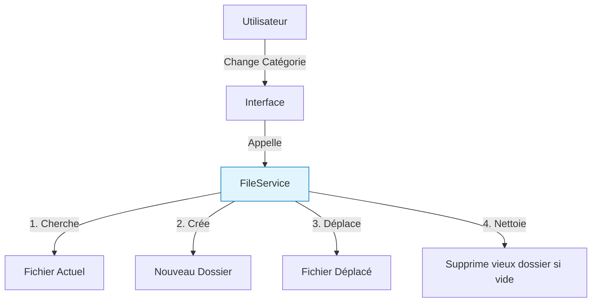

# ⚙️ Shared Services

Services utilitaires ne dépendant pas d'un domaine métier spécifique.

## 📂 File Service (`file_service.py`)

Ce service est le **Gestionnaire de Fichiers Intelligent** de FinBoard. Il fait le lien entre une transaction (en base)
et ses fichiers (sur le disque).

### Fonctionnalités Clés

#### 1. Recherche Intelligente (`trouver_fichiers_associes`)

Il est capable de retrouver le ticket de caisse d'une transaction, même si le système de nommage a changé.

- **Priorité 1 (Moderne)** : Cherche `{ID_TRANSACTION}.pdf` dans le dossier.
- **Priorité 2 (Legacy)** : Cherche dans `Dossier/Categorie/SousCategorie/`.

#### 2. Déménagement Automatique (`deplacer_fichiers_associes`)

Si vous modifiez la catégorie d'une transaction dans l'interface :

- **Avant** : Transaction "Resto" dans `Alimentation/Divers`.
- **Après** : Transaction "Resto" dans `Alimentation/Restaurant`.
- **Action** : Le fichier est déplacé physiquement sur le disque pour garder une organisation propre.

#### 3. Nettoyage (`supprimer_fichiers_associes`)

Si vous supprimez une transaction, ses fichiers sont supprimés. Si le dossier devient vide, le dossier est supprimé
aussi. **FinBoard est auto-nettoyant.**

